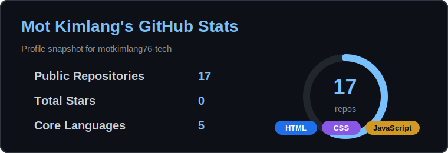

# Hi, I'm Mot Kimlang

I'm a second-year Administration student with a passion for becoming a full-stack developer. I enjoy building modern, responsive websites and continuously improving my coding skills through hands-on projects.

I'm currently learning **HTML, CSS, JavaScript, Python, Flask, SQLite, Git, and GitHub** while building real-world applications to strengthen my portfolio.

My goal is to become a professional full-stack developer by creating clean, user-friendly, and practical web applications.

Outside of coding, I enjoy exploring UI/UX design, learning new technologies, and turning ideas into functional websites.

## Socials

## Tech Stack

## GitHub Stats

<!-- profile-readme: active -->
